<div align="center">

  <!-- Custom Native Animated Neon Header Banner -->
  

  <br/><br/>

  <!-- Animated Typing Subtitle -->
  <a href="https://github.com/Asifkarim683">
    
  </a>

  <p align="center">
    <a href="mailto:asifkarim683@gmail.com"></a>
    &nbsp;
    <a href="https://ieeexplore.ieee.org/document/11448757"></a>
    &nbsp;
    <a href="https://linkedin.com/in/"></a>
    &nbsp;
    <a href="https://github.com/Asifkarim683?tab=repositories"></a>
  </p>

</div>

---

### 💫 About Me

```yaml
developer:
  name: Asif Karim
  title: Web Development and AI Engineer
  summary: >
    Passionate engineer bridging full-stack web development with applied AI & deep learning.
    Experienced in designing scalable ERP systems, full-stack platforms (Spring Boot + React),
    and publishing peer-reviewed deep learning research.
  key_highlights:
    - Research: Published IEEE Xplore Author in Deep Learning & Computer Vision (2025)
    - Experience: Software Engineering Trainee at Skill Revelation India (PHP / ERP Systems)
    - Hackathons: Built 5 prototypes with top-3 podium finishes (Odoo, IIT, Gen-AI)
    - Certifications: Anthropic AI Certified (20 Courses) | Fullstack Java (Centurion Univ)
```

- 🔬 **Published Researcher**: Author of *Canine Sentiment Analysis Using Deep Learning* published on [IEEE Xplore](https://ieeexplore.ieee.org/document/11448757) (2025).
- 💼 **Industry Experience**: Built structured, responsive ERP systems and dynamic web applications at **Skill Revelation India**.
- 🏆 **Hackathon Competitor**: Designed intuitive user interfaces and architectures for 5 successful hackathon prototypes with top-3 finishes across Odoo, IIT, and Gen-AI events.
- ⚡ **Performance & UX Focus**: Track record of optimizing web application load times by 30% and implementing responsive layouts across 10+ production projects.
- 🌱 **Continuous Learning**: Certified in 20 distinct Anthropic AI & Prompting courses, GeeksforGeeks DSA, and Fullstack Java development.

---

### 🛠️ Tech Stack & Arsenal

<div align="center">

  <p><b>Core Languages, Frameworks &amp; Tools</b></p>
  <a href="https://skillicons.dev">
    
  </a>

  <br/><br/>

| Domain | Technologies & Skills |
| :--- | :--- |
| **Languages** | `Java` `Python` `PHP` `JavaScript (ES6+)` `TypeScript` `SQL` `HTML5` `CSS3` `C++` |
| **Backend Development** | `Spring Boot` `Laravel` `PHP` `RESTful APIs` `Node.js` `Express.js` `Hibernate / JPA` |
| **Frontend Development** | `React` `Tailwind CSS` `JavaScript` `Responsive UI/UX` `HTML5/CSS3` `Vite` |
| **AI & Deep Learning** | `Deep Learning` `Computer Vision` `Machine Learning` `Prompt Engineering (Anthropic x20)` `LLM Agents` |
| **Databases & Storage** | `MySQL` `PostgreSQL` `MongoDB` `Redis` `DBMS Principles` |
| **DevOps & Tools** | `Git` `GitHub` `Docker` `Postman` `VS Code` `IntelliJ IDEA` `Linux` |

</div>

---

### 🚀 Key Projects & Research

<table>
  <tr>
    <td width="50%" valign="top">
      <h3 align="center"><b>📜 IEEE Research: Canine Sentiment Analysis</b></h3>
      <p align="center">
        
        
        
      </p>
      <p>Peer-reviewed scientific research paper utilizing computer vision and deep learning architectures to classify and interpret sentiment patterns from canine facial and behavioral features.</p>
      <ul>
        <li>Published by the Institute of Electrical and Electronics Engineers (IEEE)</li>
        <li>Document ID: <a href="https://ieeexplore.ieee.org/document/11448757"><b>IEEE Xplore #11448757</b></a></li>
      </ul>
      <p align="center">
        <a href="https://ieeexplore.ieee.org/document/11448757"><b>Read Publication on IEEE ➔</b></a>
      </p>
    </td>
    <td width="50%" valign="top">
      <h3 align="center"><b>⚔️ CodeArena: Coding Platform</b></h3>
      <p align="center">
        
        
        
      </p>
      <p>A full-stack competitive programming and coding platform built with Spring Boot and React, engineered as a group project during the Fullstack Java Developer certification at Centurion University.</p>
      <ul>
        <li>Interactive problem sets, test case evaluation & leaderboard</li>
        <li>Clean REST API architecture + responsive React frontend</li>
      </ul>
      <p align="center">
        <a href="https://github.com/Asifkarim683/codearena"><b>Explore Repository ➔</b></a>
      </p>
    </td>
  </tr>
  <tr>
    <td width="50%" valign="top">
      <h3 align="center"><b>🤖 AI Payment Failure Recovery Agent</b></h3>
      <p align="center">
        
        
        
      </p>
      <p>An intelligent agent designed to autonomously detect transaction errors, classify root causes, and execute recovery workflows to prevent customer churn and drop-offs.</p>
      <ul>
        <li>Smart heuristics for financial error categorization</li>
        <li>Automated retry policies & re-engagement actions</li>
      </ul>
      <p align="center">
        <a href="https://github.com/Asifkarim683/ai-payment-failure-recovery-agent"><b>Explore Repository ➔</b></a>
      </p>
    </td>
    <td width="50%" valign="top">
      <h3 align="center"><b>📄 AI Resume Agent</b></h3>
      <p align="center">
        
        
        
      </p>
      <p>AI-driven resume parsing and ATS optimization engine using modern LLMs to evaluate candidate resumes, calculate match scores against job postings, and offer targeted improvements.</p>
      <ul>
        <li>Automated semantic matching & keyword alignment</li>
        <li>Instant formatting feedback & ATS readiness scoring</li>
      </ul>
      <p align="center">
        <a href="https://github.com/Asifkarim683/ai-resume-agent"><b>Explore Repository ➔</b></a>
      </p>
    </td>
  </tr>
</table>

---

### 🏆 Certifications & Key Achievements

<div align="center">

| Achievement / Certificate | Issuing Organization / Details |
| :--- | :--- |
| **Research Paper Publication** | **IEEE (Institute of Electrical and Electronics Engineers)** — *Canine Sentiment Analysis Using Deep Learning (2025)* |
| **20x AI & Prompting Skill Courses** | **Anthropic** — Advanced Prompt Engineering, LLM Capabilities & AI Workflows |
| **Fullstack Java Developer Certification** | **Centurion University of Technology and Management** — Spring Boot, Java & React |
| **5x Hackathon Top-3 Finishes** | **Odoo, IIT & Gen-AI Hackathons** — UI/UX Design & Rapid MVP Prototyping |
| **Data Structures & Algorithms** | **GeeksforGeeks** — Algorithms, Problem Solving & Software Engineering Foundations |

</div>

---

### 📊 GitHub Activity & Metrics

<div align="center">
  <table border="0">
    <tr>
      <td>
        
      </td>
      <td>
        
      </td>
    </tr>
  </table>

  <p align="center">
    
  </p>

  <p align="center">
    
  </p>
</div>

---

### 🤝 Let's Connect & Collaborate!

<div align="center">

  <p>I'm open to discussing full-stack engineering, applied AI/ML initiatives, open-source projects, and new software development opportunities!</p>

  <a href="mailto:asifkarim683@gmail.com">
    
  </a>
  &nbsp;
  <a href="https://linkedin.com/in/">
    
  </a>
  &nbsp;
  <a href="https://github.com/Asifkarim683">
    
  </a>
  &nbsp;
  <a href="https://ieeexplore.ieee.org/document/11448757">
    
  </a>

  <br/><br/>
  
  <!-- Custom Native Animated Footer Banner -->
  

</div>
