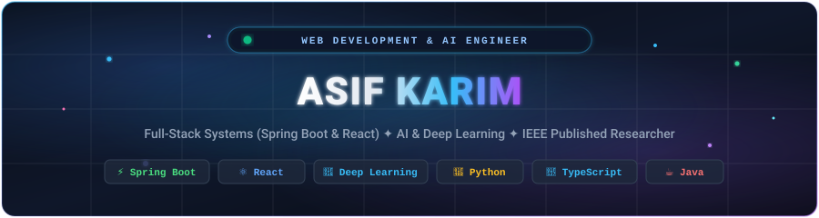

<div align="center">

  <!-- Custom Native Animated Neon Header Banner -->
  

  <br/><br/>

  <!-- Animated Typing Subtitle -->
  <a href="https://github.com/Asifkarim683">
    
  </a>

  <p align="center">
    <a href="mailto:asifkarim683@gmail.com"></a>
    &nbsp;
    <a href="https://ieeexplore.ieee.org/document/11448757"></a>
    &nbsp;
    <a href="https://linkedin.com/in/"></a>
    &nbsp;
    <a href="https://github.com/Asifkarim683?tab=repositories"></a>
  </p>

</div>

---

### 💫 About Me

```yaml
developer:
  name: Asif Karim
  title: Web Development and AI Engineer
  summary: >
    Passionate engineer bridging full-stack web development with applied AI, autonomous agents & deep learning.
    Experienced in designing competitive judge engines (Spring Boot + React),
    autonomous LangGraph agents, enterprise web applications, and publishing peer-reviewed deep learning research.
  key_highlights:
    - Experience: Software Engineering Trainee at Skill Revelation India (Web & ERP Systems)
    - Research: Published IEEE Xplore Author in Deep Learning & Computer Vision (2025)
    - Major Project: Two-Stage Diabetic Retinopathy Detection & Severity AI (98.09% Acc, 0.96 Kappa)
    - Autonomous AI: LangGraph Agents, Local Private LLMs (Ollama), & Source-Grounded Multilingual RAG
    - Hackathons: Built 5 prototypes with top-3 podium finishes (Odoo, IIT, Gen-AI)
    - Certifications: Anthropic AI Certified (20 Courses) | Fullstack Java (Centurion Univ)
```

- 💼 **Professional Experience**: Software Engineering Trainee at **Skill Revelation India**, building structured, responsive ERP systems and dynamic web applications with a focus on performance optimization (achieved 30% reduction in load times).
- 🔬 **Published Researcher**: Author of *Canine Sentiment Analysis Using Deep Learning* published on [IEEE Xplore](https://ieeexplore.ieee.org/document/11448757) (2025).
- 👁️ **Clinical Healthcare AI**: Built an end-to-end **Two-Stage Diabetic Retinopathy Diagnostic System** with PyTorch, Grad-CAM attention heatmaps, and Gemini multimodal report generation ([Repository](https://github.com/Asifkarim683/Diabetic-Retinopathy-detection-using-deep-learning)).
- 🤖 **Agentic & RAG Systems**: Engineered autonomous multi-agent state machines with **LangGraph**, local voice AI operating environments with **Ollama + Three.js**, and safety-guarded medical RAG assistants across 6 Indian languages.
- 🏆 **Hackathon Competitor**: Designed intuitive user interfaces and architectures for 5 successful hackathon prototypes with top-3 finishes across Odoo, IIT, and Gen-AI events.
- ⚡ **Performance & UX Focus**: Track record of optimizing web application performance and implementing responsive layouts across 10+ production projects.

---

### 🛠️ Tech Stack & Arsenal

<div align="center">

  <p><b>Core Languages, Frameworks &amp; Tools</b></p>
  <a href="https://skillicons.dev">
    
  </a>

  <br/><br/>

| Domain | Technologies & Skills |
| :--- | :--- |
| **Languages** | `Java` `Python` `TypeScript` `JavaScript (ES6+)` `SQL` `HTML5` `CSS3` `C++` |
| **Backend & Microservices** | `Spring Boot` `FastAPI` `RESTful APIs` `Node.js` `Express.js` `Hibernate / JPA` `tRPC` |
| **Frontend & UI** | `React 19` `Next.js` `Tailwind CSS` `JavaScript` `TypeScript` `Three.js` `Monaco Editor` `Vite` |
| **AI, Agents & Deep Learning** | `LangGraph` `LangChain` `PyTorch` `Computer Vision` `Google Gemini` `Ollama (Local LLMs)` `Prompt Engineering (Anthropic x20)` `RAG` |
| **Databases & Storage** | `PostgreSQL` `MySQL` `MongoDB` `Redis` `SQLite (WAL)` `Drizzle ORM` |
| **DevOps & Tools** | `Docker & Docker Compose` `GitHub Actions CI/CD` `Git` `Postman` `VS Code` `IntelliJ IDEA` `Linux` |

</div>

---

### 💼 Professional Experience & Engineering Background

<div align="center">

| Role & Organization | Key Focus & Impact |
| :--- | :--- |
| **Software Engineering Trainee** <br/>*Skill Revelation India* | • Engineered structured, responsive ERP web applications and modular database schemas.<br/>• Optimized frontend rendering and asset delivery, achieving a **30% reduction in page load times**.<br/>• Built mobile-first responsive interfaces across **10+ web projects**, increasing engagement. |
| **Fullstack Java Developer Trainee** <br/>*Centurion University of Technology and Management* | • Architected **CodeArena**, a competitive coding platform with an automated multi-language judge sandbox.<br/>• Designed Spring Boot RESTful microservices, JPA transaction management, and JWT role-based security. |

</div>

---

### 🤖 1. Autonomous AI & Agentic Systems

<table>
  <tr>
    <td width="50%" valign="top">
      <h3 align="center"><b>💸 Recoverly.ai (Payment Recovery Agent)</b></h3>
      <p align="center">
        <a href="https://payment-recovery-agent-three.vercel.app"></a>
        
        
        
      </p>
      <p>Autonomous AI agent system designed to detect transaction errors, classify root causes via smart heuristics, and execute proactive recovery workflows to eliminate customer drop-offs.</p>
      <ul>
        <li><b>Tech Stack:</b> TypeScript 5.9, React 19, Google Gemini 3.5, Tailwind CSS 4.1, tRPC v11, Drizzle ORM, PostgreSQL</li>
        <li><b>Live Deployment:</b> <a href="https://payment-recovery-agent-three.vercel.app"><b>payment-recovery-agent-three.vercel.app</b></a></li>
      </ul>
      <p align="center">
        <a href="https://github.com/Asifkarim683/ai-payment-failure-recovery-agent"><b>Explore Repository ➔</b></a>
      </p>
    </td>
    <td width="50%" valign="top">
      <h3 align="center"><b>⚡ ResuForge AI (ATS & Interview Studio)</b></h3>
      <p align="center">
        
        
        
        
      </p>
      <p>Autonomous, multi-node agent state machine that performs ATS compliance audits, STAR-method bullet optimization, 6-second recruiter scans, and mock interview simulations.</p>
      <ul>
        <li><b>Tech Stack:</b> Python, LangGraph state machine, Groq Llama 3.3 70B, FastAPI, Streamlit, Docker</li>
        <li><b>Reasoning Engine:</b> Graph-based multi-step candidate evaluation and outreach generation</li>
      </ul>
      <p align="center">
        <a href="https://github.com/Asifkarim683/ai-resume-agent"><b>Explore Repository ➔</b></a>
      </p>
    </td>
  </tr>
  <tr>
    <td width="50%" valign="top">
      <h3 align="center"><b>🧠 Zyra (Cybernetic Voice AI & OS)</b></h3>
      <p align="center">
        
        
        
        
      </p>
      <p>Local, privacy-first autonomous AI companion and voice operational environment featuring neural speech synthesis, typo-tolerant spell healing, dynamic audio player, and isolated VM math execution.</p>
      <ul>
        <li><b>Tech Stack:</b> TypeScript, React 18, Ollama, Three.js 3D sphere, SQLite WAL, Node.js VM</li>
        <li><b>Architecture:</b> Offline local inference, semantic vector memory, proactive intelligence</li>
      </ul>
      <p align="center">
        <a href="https://github.com/Asifkarim683/zyra-agent"><b>Explore Repository ➔</b></a>
      </p>
    </td>
    <td width="50%" valign="top">
      <h3 align="center"><b>🏥 Multilingual Health RAG Assistant</b></h3>
      <p align="center">
        
        
        
        
      </p>
      <p>Safety-first, source-grounded Retrieval-Augmented Generation assistant answering community health questions in <b>Hindi, Odia, Bengali, Telugu, Tamil, and English</b> with verified citations.</p>
      <ul>
        <li><b>Tech Stack:</b> Python 3.10+, FastAPI, LangChain, React, Docker Compose, CI/CD Pipeline</li>
        <li><b>Safety Guardrails:</b> Strict medical boundaries and anti-hallucination citation checks</li>
      </ul>
      <p align="center">
        <a href="https://github.com/Asifkarim683/Multilingual-health-FAQ-assistant-for-local-languages"><b>Explore Repository ➔</b></a>
      </p>
    </td>
  </tr>
</table>

---

### 👁️ 2. Computer Vision & Healthcare AI Research

<table>
  <tr>
    <td width="50%" valign="top">
      <h3 align="center"><b>👁️ Diabetic Retinopathy Diagnostic AI (Major Project)</b></h3>
      <p align="center">
        
        
        
        
      </p>
      <p>Two-stage deep learning pipeline for automated retinal fundus screening and 4-tier severity grading with Ben Graham preprocessing, Grad-CAM visual heatmaps, and Gemini multimodal clinical reports.</p>
      <ul>
        <li><b>Stage 1:</b> Binary screening (98.09% Acc, 0.9988 AUC, 0.9614 Kappa)</li>
        <li><b>Stage 2:</b> Multi-class severity classification (Mild, Moderate, Severe, Proliferative)</li>
        <li><b>Explainable AI:</b> Grad-CAM attention heatmaps + automated doctor-style diagnostic notes</li>
      </ul>
      <p align="center">
        <a href="https://github.com/Asifkarim683/Diabetic-Retinopathy-detection-using-deep-learning"><b>Explore Major Project Repo ➔</b></a>
      </p>
    </td>
    <td width="50%" valign="top">
      <h3 align="center"><b>📜 IEEE Research: Canine Sentiment Analysis (2025)</b></h3>
      <p align="center">
        
        
        
      </p>
      <p>Peer-reviewed scientific research paper utilizing computer vision and deep learning architectures to classify and interpret sentiment patterns from canine facial and behavioral features.</p>
      <ul>
        <li>Published by the Institute of Electrical and Electronics Engineers (IEEE)</li>
        <li>Document Identifier: <a href="https://ieeexplore.ieee.org/document/11448757"><b>IEEE Xplore #11448757</b></a></li>
        <li><b>Domain:</b> Animal welfare diagnostics & deep visual feature extraction</li>
      </ul>
      <p align="center">
        <a href="https://ieeexplore.ieee.org/document/11448757"><b>Read Publication on IEEE ➔</b></a>
      </p>
    </td>
  </tr>
</table>

---

### ⚔️ 3. Full-Stack Systems & Platform Architecture

<div align="center">
  <table width="100%">
    <tr>
      <td width="100%" valign="top">
        <h3 align="center"><b>⚔️ CodeArena: Online Coding & Automated Judge Platform</b></h3>
        <p align="center">
          
          
          
          
          
        </p>
        <p>A full-stack competitive programming and judge platform inspired by LeetCode and HackerRank. Engineered with an automated test-case evaluation engine, custom multi-language compilation sandboxing (Java, Python, C++, and JavaScript), timed anti-cheat coding contests, and real-time leaderboards.</p>
        <ul>
          <li><b>Backend Architecture:</b> Spring Boot RESTful API service, JWT token-based authentication with Role-Based Access Control (RBAC), and session security.</li>
          <li><b>Judge Engine & Sandbox:</b> Automated verdicts (Accepted, Wrong Answer, Time Limit Exceeded, Runtime Error, Compilation Error).</li>
          <li><b>Interactive Frontend:</b> Responsive React UI integrated with Monaco Editor (VS Code core), problem search/filter indexing, and timed contest scoring.</li>
        </ul>
        <p align="center">
          <a href="https://github.com/Asifkarim683/codearena"><b>Explore CodeArena Repository ➔</b></a>
        </p>
      </td>
    </tr>
  </table>
</div>

---

### 🏆 Certifications & Key Achievements

<div align="center">

| Achievement / Certificate | Issuing Organization / Details |
| :--- | :--- |
| **Research Paper Publication** | **IEEE (Institute of Electrical and Electronics Engineers)** — *Canine Sentiment Analysis Using Deep Learning (2025)* |
| **20x AI & Prompting Skill Courses** | **Anthropic** — Advanced Prompt Engineering, LLM Capabilities & AI Workflows |
| **Fullstack Java Developer Certification** | **Centurion University of Technology and Management** — Spring Boot, Java & React |
| **5x Hackathon Top-3 Finishes** | **Odoo, IIT & Gen-AI Hackathons** — UI/UX Design & Rapid MVP Prototyping |
| **Data Structures & Algorithms** | **GeeksforGeeks** — Algorithms, Problem Solving & Software Engineering Foundations |

</div>

---

### 📊 GitHub Activity & Metrics

<div align="center">
  <table border="0">
    <tr>
      <td>
        
      </td>
      <td>
        
      </td>
    </tr>
  </table>
</div>

---

### 🤝 Let's Connect & Collaborate!

<div align="center">

  <p>I'm open to discussing full-stack engineering, applied AI/ML initiatives, open-source projects, and new software development opportunities!</p>

  <a href="mailto:asifkarim683@gmail.com">
    
  </a>
  &nbsp;
  <a href="https://linkedin.com/in/">
    
  </a>
  &nbsp;
  <a href="https://github.com/Asifkarim683">
    
  </a>
  &nbsp;
  <a href="https://ieeexplore.ieee.org/document/11448757">
    
  </a>

  <br/><br/>
  
  <!-- Custom Native Animated Footer Banner -->
  

</div>
